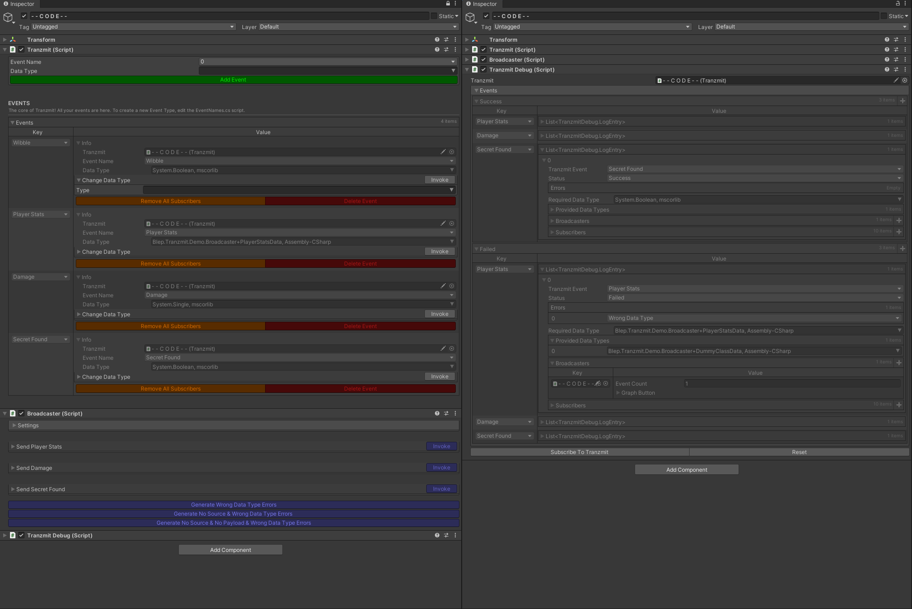
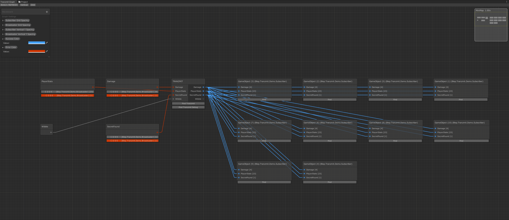
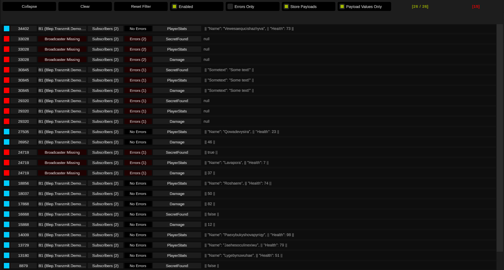

# Tranzmit
Unity 3D Event system that uses the new Experimental Unity GraphView (https://docs.unity3d.com/ScriptReference/Experimental.GraphView.GraphView.html), allowing visualization of the flow of event data.

REQUIRED COMPONENT - Will Not Compile without Odin Inspector!:
https://odininspector.com/

NOTE - Graph will not be operational until an Event has been added.

### Releases
* V1 - Tranzmit Core, and Debug V1 that works with Unity Graphview API based debug visualization
* V2 - Minor Tweaks to Tranzmit Core, new Debug V2 (V1 is still included) with a Unity UI based debug visualization to go with it.

### Details
I love Event Driven Architectures (EDA). It makes for nice, decoupled code. But I am not a fan of how ambiguous the relationships between scripts can be. Enter Tranzmit, a fully functional, object based (send anything!) event system... with a twist!

### Main Features:
* Multi level error checking / handling
* Multiple real time logging and visual feedback tools
* Various code examples
* Send any object
* Minimal coding required
* Clean Interface power by Odin Inspector
* Multi platform
* Zero Garbage Collection when ran as compiled EXE (as far as my tests show!)

I have also developed various event logging tools, for the monitoring and debugging of Events. Those tools are further extended by visualization tools.

V1 Debug is leveraging the Unity GraphView API, along with the power of Odin Inspector, you can also see in real time which scripts are sending events, and which scripts are listening, receiving ...and failing! Clicking on graph elements takes you to the scripts, acting as a navigation system for your code!

V2 Debug uses the Unity UI API for compiled runtime visualization and feedback. It has filtering options and controls for the Debug V2 tool.

Why the dependency on Odin Inspector? In short, this project was coded for myself, and the last thing I want to be doing is hand coding custom Unity interfaces, when I can do it in a fraction of the time (and better!) with Odin Inspector. If you do any kind of coding in Unity on a regular basis, you should seriously consider using Odin Inspector. It's the first thing I setup in any new project.

That said, if there is enough interest in Tranzmit without Odin Inspector, I would consider developing the custom interfaces required.

I hope this proves useful to someone, and if you have any comments or improvements regarding this code, please do so! :)

Additional info will be made available at https://blep.io

Overview video on YouTube: https://youtu.be/BfAUmtgjHac

Odin Inspector Community Tools: https://odininspector.com/community-tools/58C/tranzmit-an-event-system-with-visual-feedback-and-multi-level-error-checking

